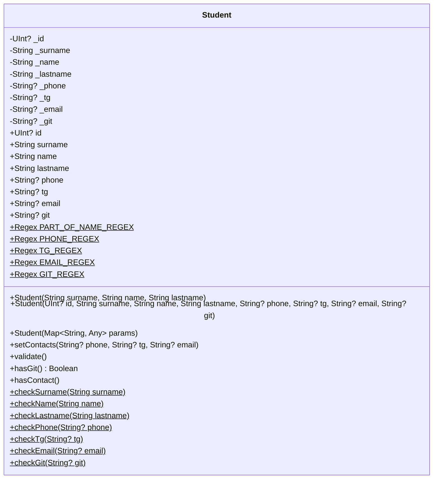
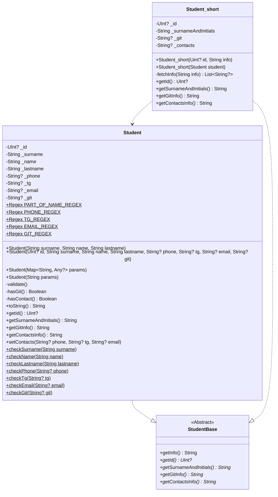
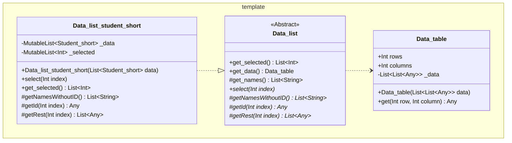
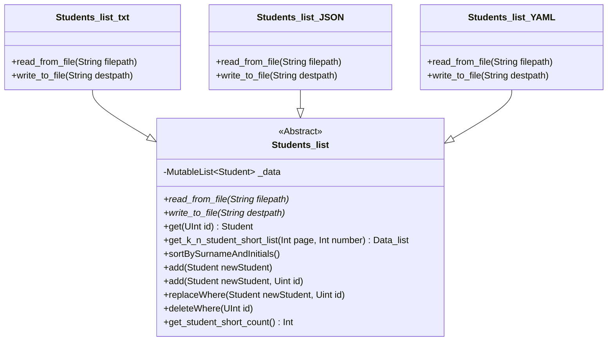
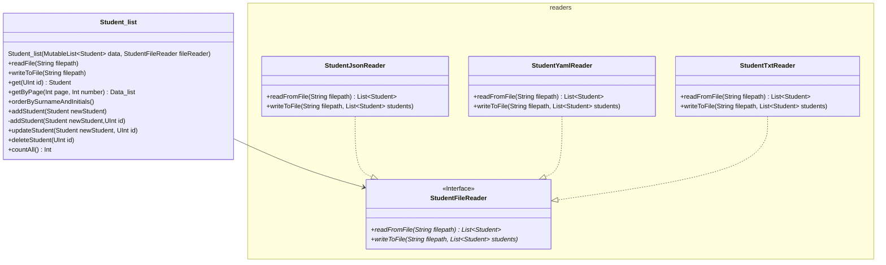

## Диаграммы классов 
### Лaб. 1
#### Класс Student

### Лаб.2
#### Рефакторинг, Student_short и базовый класс

#### Классы Data_table, Data_list и Data_list_student_short

### Лаб. 3
#### Классы Students_list и наследники (txt, json, yaml)

#### Применение паттерна "Стратегия"

