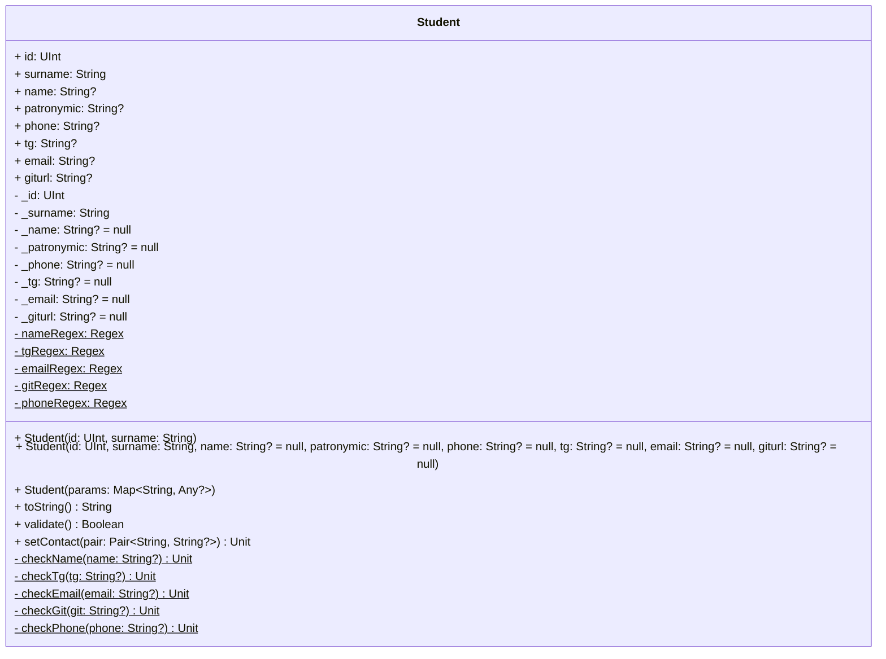

### Student.kt

```mermaid
---
Class Student
---
classDiagram
class Student {
    + id: UInt
    + surname: String
    + name: String?
    + patronymic: String?
    + phone: String?
    + tg: String?
    + email: String?
    + giturl: String?
    - _id: UInt
    - _surname: String
    - _name: String? = null
    - _patronymic: String? = null
    - _phone: String? = null
    - _tg: String? = null
    - _email: String? = null
    - _giturl: String? = null
    - nameRegex: Regex$
    - tgRegex: Regex$
    - emailRegex: Regex$
    - gitRegex: Regex$
    - phoneRegex: Regex$
    + Student(id: UInt, surname: String)
    + Student(id: UInt, surname: String, name: String? = null, patronymic: String? = null, phone: String? = null, tg: String? = null, email: String? = null, giturl: String? = null)
    + Student(params: Map~String, Any?~)
    + toString() String
    + validate() Boolean
    + setContact(pair: Pair~String, String?~) Unit
    - checkName(name: String?) Unit$
    - checkTg(tg: String?) Unit$
    - checkEmail(email: String?) Unit$
    - checkGit(git: String?) Unit$
    - checkPhone(phone: String?) Unit$
}
```
