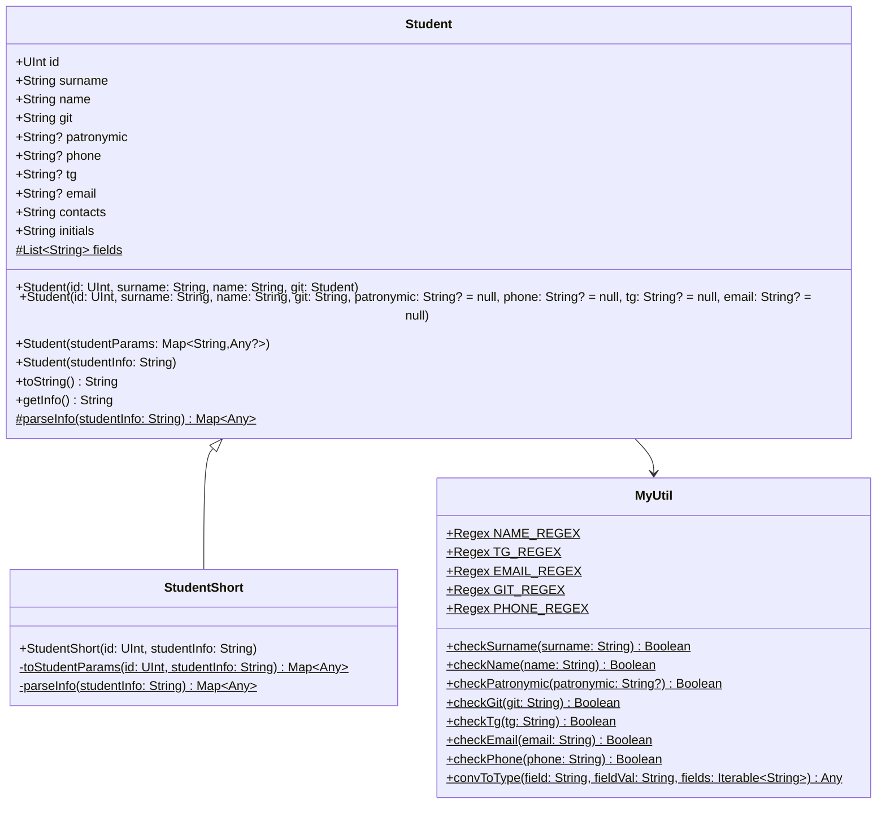

### Student.kt

```mermaid
---
Лаб. 2
---
classDiagram
Student <|-- StudentShort
Student --> MyUtil
class Student {
    +UInt id
    +String surname
    +String name
    +String git
    +String? patronymic
    +String? phone
    +String? tg
    +String? email
    +String contacts
    +String initials
    +Student(id: UInt, surname: String, name: String, git: Student)
    +Student(id: UInt, surname: String, name: String, git: String, patronymic: String? = null, phone: String? = null, tg: String? = null, email: String? = null)
    +Student(studentParams: Map~String,Any?~)
    +Student(studentInfo: String)
    +toString() String
    +getInfo() String
    #List~String~ fields$
    #parseInfo(studentInfo: String)$ Map~Any~
}
class StudentShort {
    +StudentShort(id: UInt, studentInfo: String)
    -toStudentParams(id: UInt, studentInfo: String)$ Map~Any~
    -parseInfo(studentInfo: String)$ Map~Any~
}
class MyUtil {
    +Regex NAME_REGEX$
    +Regex TG_REGEX$
    +Regex EMAIL_REGEX$
    +Regex GIT_REGEX$
    +Regex PHONE_REGEX$
    +checkSurname(surname: String)$ Boolean
    +checkName(name: String)$ Boolean
    +checkPatronymic(patronymic: String?)$ Boolean
    +checkGit(git: String)$ Boolean
    +checkTg(tg: String)$ Boolean
    +checkEmail(email: String)$ Boolean
    +checkPhone(phone: String)$ Boolean
    +convToType(field: String, fieldVal: String, fields: Iterable~String~)$ Any
}
```